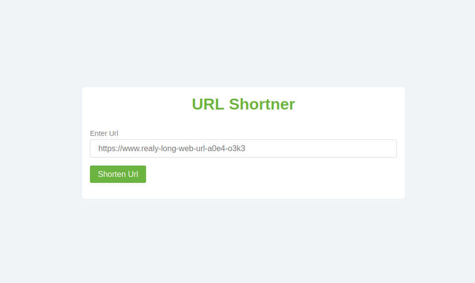

# URL Shortener

This is a Spring Boot application for URL shortening. It allows users to submit long URLs and receive a shortened version for easy sharing.

## Technologies Used

*   Spring Boot
*   JPA (Java Persistence API)
*   PostgreSQL

## Setup

### Prerequisites

*   Java Development Kit (JDK) 17 or later
*   Maven
*   Docker

### Building and Running with Maven

1.  Clone the repository:

    ```bash
    git clone https://github.com/manishdait/url-shortner
    ```

2.  Navigate to the project directory:

    ```bash
    cd url-shortener
    ```

3. Setup Postgres Container:
   ```bash
    docker compose up -d 
   ```

4.  Run SpringBoot application:

    ```bash
    mvn spring-boot:run
    ```

## Usage

### Accessing UI
Once the application is running, the user interface is accessible at:
`http://localhost:8080/url-shortner`

### Shortening URLs

1.  Open the URL in your web browser (`http://localhost:8080/url-shortner`).
2.  Enter the long URL you want to shorten in the provided input field.
3.  Click the "Shorten URL" button.
4.  The application will generate a shortened URL and display it on the page.
    *   If the entered URL is invalid, an appropriate error message will be shown.
5. Visiting a shortened URL will redirect you to the original long URL


## Result

